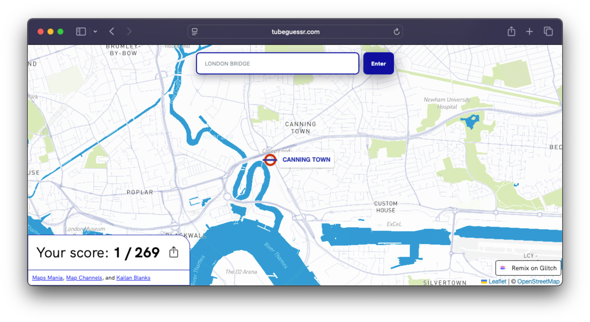

# TubeGuessr

**How many Tube stations can you name? Fill in the map of London Underground stations using your knowledge of the city.**

## Project History

This game was originally created by Maps Mania in 2023 [(article)](https://googlemapsmania.blogspot.com/2023/10/the-london-underground-map-quiz.html) which was in turn inspired by [SF Street Names](https://carvin.github.io/sf-street-names/).

It was created as a project on [Glitch](https://en.wikipedia.org/wiki/Glitch,_Inc.), which allowed me to "remix" the project with a few enhancements, such as progress saving and more lenient input handling.

Glitch has since closed the doors on their hosting service, so I have migrated the game to an alternative hosting service, with the source code now available here on GitHub. The app is currently hosted on [Fastly Compute](https://www.fastly.com/products/edge-compute) using [js-compute-static-publish](https://github.com/fastly/compute-js-static-publish).

## Repository Structure

- `/public` contains the static files that make up the game – the HTML, CSS, and JavaScript files.

- `/compute-js` contains the source code for the Fastly Compute service that serves the files from the `/public` directory.

- `/` the root of the repository contains the Terraform configuration for the DNS zone and Fastly TLS configuration.

## License?

I am not the original author of this game, so I cannot license it. The original author retained the default Glitch license file in their project, but did not insert their name, so I am not able to provide a concrete answer to anyone's rights over this project. I maintain this repository in the interest of preserving and sharing this enjoyable game. Please refer to the [original article on Maps Mania](https://googlemapsmania.blogspot.com/2023/10/the-london-underground-map-quiz.html) for more information on the project's usage rights.
